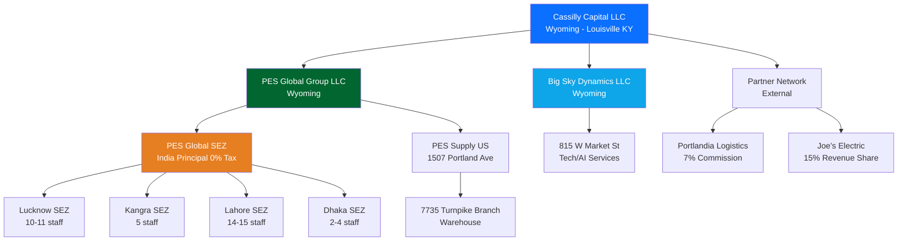

# Cassilly Capital - Organization Chart

## Visual Hierarchy

## Entity Roles

### Cassilly Capital LLC
- **Role**: Ultimate holding company
- **Formation**: Wyoming LLC
- **Operations**: Louisville, Kentucky
- **Functions**:
  - Master P&L consolidation
  - Strategic acquisitions (Joe's Electric pathway)
  - Banking relationships (Stock Yards)
  - IP/trademark ownership

### PES Global Group LLC
- **Role**: Supply chain distribution platform
- **Catalog**: 10M SKUs across 229 manufacturers
- **Tax Strategy**: SEZ India (0% tax) → UAE RAKEZ migration
- **Revenue Model**:
  - Phase 1: 8% agency commission + 5% US sales
  - Phase 3: 28% principal profit (0% tax)

### Big Sky Dynamics LLC
- **Role**: Technology and AI services
- **Services**: Odoo ERP, headless CMS, CRM, automation
- **Billing**: Cost-plus 20% to PES/SEZ entities
- **Banking**: Stock Yards #083000564

### Partner Network
- **Portlandia Logistics**: Freight broker (7735 National Turnpike)
- **Joe's Electric**: Catalog partner (Nashville territory)
- **Model**: Revenue share, acquisition earnout pathways

## Staff Count by Location

| Location | Entity | Headcount | Key Staff |
|----------|--------|-----------|----------|
| Louisville KY (1507 Portland) | PES Supply US | TBD | Sales/procurement |
| Louisville KY (815 Market) | Big Sky Dynamics | TBD | Tech/dev team |
| Louisville KY (7735 Turnpike) | Portlandia | TBD | Logistics |
| Lucknow, India | PES Supply SEZ | 10-11 | Balendra Singh, Gaurav Singh |
| Kangra, India | PES Supply SEZ | 5 | Amit Pathania, Sushil Thakur |
| Lahore, Pakistan | PES Supply SEZ | 14-15 | Abdul Baseer, Rida Soomro |
| Dhaka, Bangladesh | PES Supply SEZ | 2-4 | Byzid Bostami, SM Rubayat |
| **Total** | | **31-35+** | |

## Control Flow

1. **Strategic Decisions** → Cassilly Capital (Alex Cassilly)
2. **Operational Execution** → Subsidiary managers
3. **Financial Reporting** → Consolidated to Cassilly
4. **Compliance** → Wyoming (home) + Kentucky (foreign filing)

---
*Updated: February 7, 2026*
